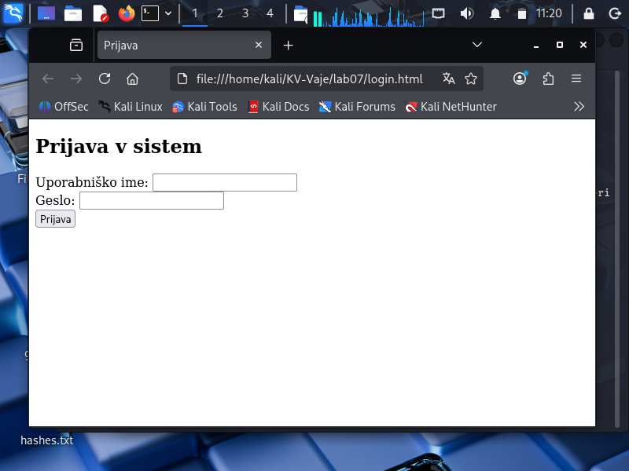

### (1) Priprava testnega phishing obrazca

## nano login.html
'''bash
<!DOCTYPE html>
<html lang="sl">
<head>
<meta charset="UTF-8">
<title>Prijava</title>
</head>
<body>
<h2>Prijava v sistem</h2>
<form method="POST" action="">
  Uporabniško ime: <input type="text" name="username"> 
  Geslo: <input type="password" name="password"> 
  <input type="submit" value="Prijava">
</form>
</body>
</html>
'''
## Posnetek zaslona lažne prijavne strani

## Posnetek zaslona lažne prijavne strani - kopija -> tehnicne zadeve - ni slo login.html

### (2) Zagon SET in kloniranje
(screenshots/korak_1.png)
(screenshots/korak_2.png)
(screenshots/kloniranaStran.png)

## zagon 
'''bash
firefox http://10.0.2.15
'''
-> VPIS PODATKOV "test" in "geslo123"

### (3) Rezultat - zajeti podatki
(screenshots/zajeti_podatki.png)

### (4) ANALIZA, REFLEKSIJA in POROCILO
- posnetki ze dodani zgoraj.

Phishing strani imajo pogosto naslednje značilnosti:
- napačen ali sumljiv URL naslov
- pomanjkanje HTTPS in varnostnih certifikatov
- zelo preprost dizajn
- zahteva po vnosu občutljivih podatkov brez dodatne preverbe
- hitro zahtevajo vnos podatkov, da uporabnik ne opazi opozoril

Uporabniki se lahko zaščitijo z:
- preverjanjem URL naslova
- uporabo upravljalnikov gesel
- dvostopenjsko avtentikacijo
- previdnostjo pri povezavah iz e-pošte

Moderne spletne strani otežujejo phishing napade z uporabo HTTPS,
CSRF zaščite, Content Security Policy (CSP) in dodatnih preverjanj
pristnosti uporabnika

