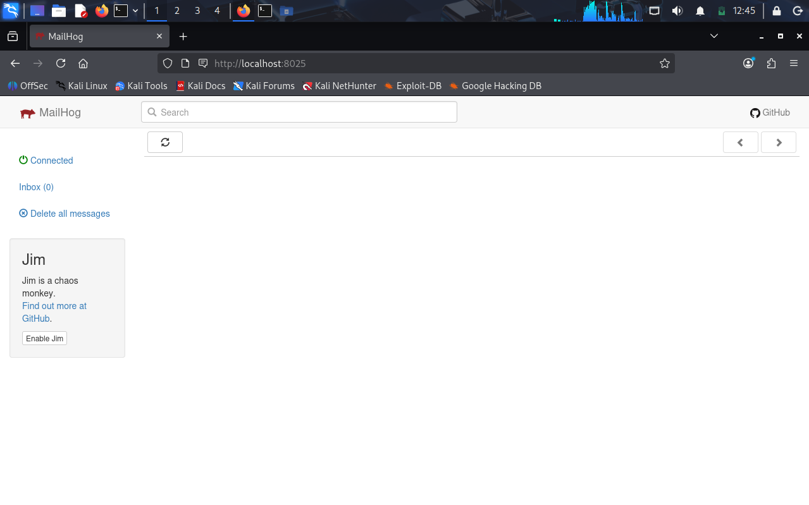
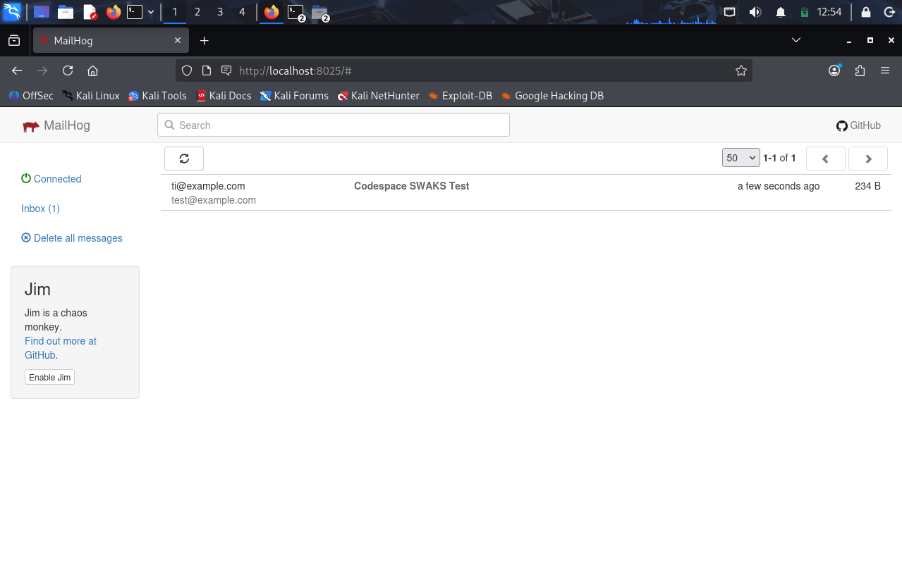
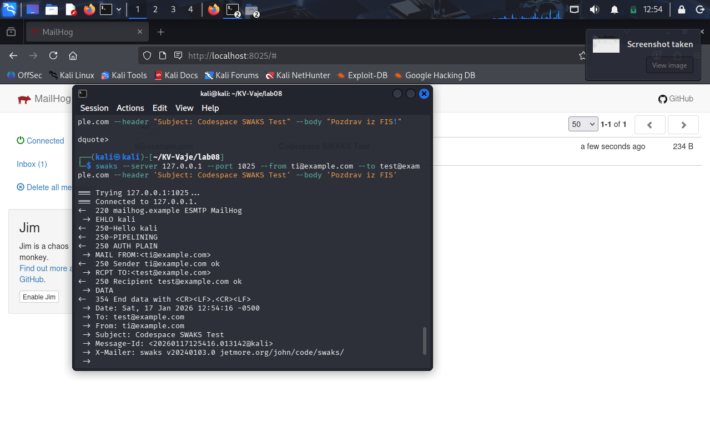
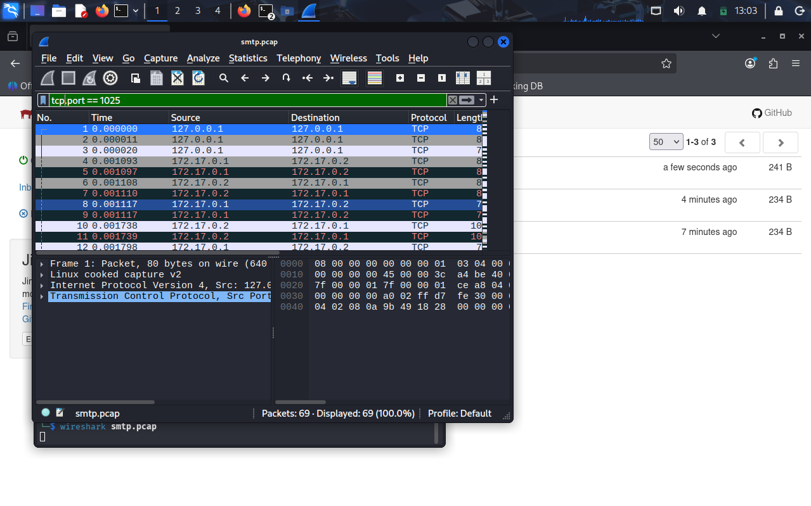
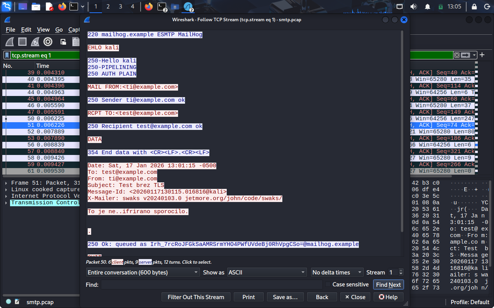
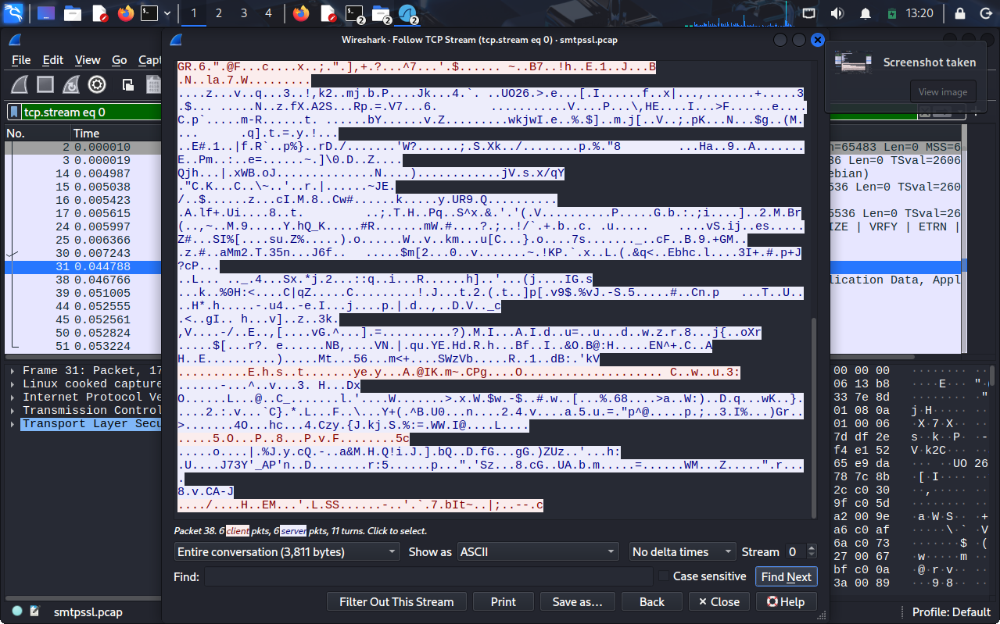

### SIMULACIJA RANLJIVOSTI

## Zagon MailHog

## Zajem s tcpdump

## Testno sporocilo s swaks

## Analiza v Wiresharku

### SIFRIRANA KOMUNIKACIJA

### REFLEKSIJA

# (1) Nešifrirano vs. šifrirano sporočilo

- Nešifrirano (npr. SMTP brez TLS) potuje v čistopisu; napadalec lahko prebere vsebino, naslove in glave sporočila.

- Šifrirano (npr. SMTP s STARTTLS) je med prenosom nerazumljivo; napadalec vidi le paketne informacije (IP, vrata).

# (2) Preverjanje PGP fingerprinta
- Preverjanje zagotovi, da je javni ključ res pošiljateljev in preprečuje man-in-the-middle napade.

# (3) Uporaba PGP in Signal

- PGP: za e-pošto in dokumente, kjer želimo dolgoročno šifrirano in podpisano vsebino.

- Signal: za instant messaging in realnočasovne pogovore z end-to-end šifriranjem.

# (4) E2E šifriranje kot privzeto

- Da, end-to-end (E2E) šifriranje bi moralo biti privzeto.

- Varnost: preprečuje prestrezanje, krajo ali manipulacijo podatkov.

- Zasebnost: varuje komunikacijo pred tretjimi osebami, tudi pred ponudniki storitev.

- Uporabniška izkušnja: ob pravilni implementaciji je komunikacija enostavna in nemotena, šifriranje pa poteka v ozadju.

Privzeto E2E šifriranje zagotavlja zanesljivo zaščito podatkov in zasebnost brez dodatnega truda uporabnika.
