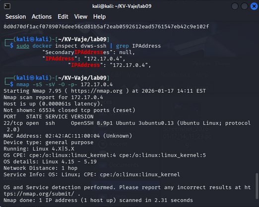
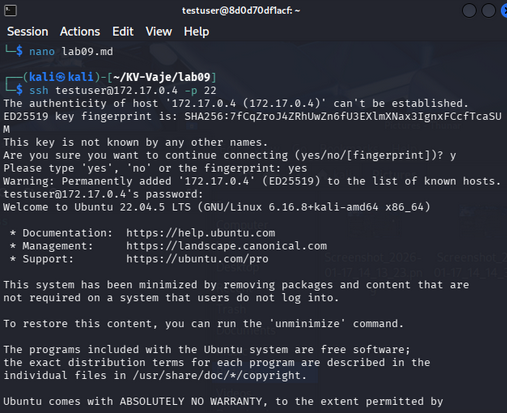
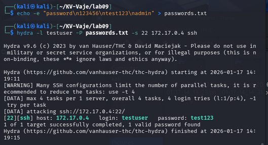

### Korak 1
- IP naslov cilja: 172.17.0.4

- Odprta vrata: 22/tcp
- Storitev: SSH
- Verzija: OpenSSH 8.9p1 Ubuntu 3ubuntu0.13
- Operacijski sistem: Ubuntu Linux (Docker container, protocol 2.0)



### Korak 2
- Uspešna prijava potrjuje, da je SSH dostopen.



### Korak 3 in 4
- ustvarjen passwords.txt

```bash 
Hydra v9.6 starting
[22][ssh] host: 172.17.0.4 login: testuser password: test123
1 of 1 target successfully completed, 1 valid password found
```
- Napad je bil uspešen, ker je bilo uporabljeno šibko geslo: test123



### ANALIZA in POROCILO
- dokazi in izpisi so vkljuceni zgoraj

# Zakaj so šibka gesla nevarna?
- Omogočajo hiter brute-force napad
- Ne zahtevajo veliko računske moči
- Pogosto so del slovarjev napadalcev

# Zakaj zapirati neuporabljene porte?
- Manj odprtih vrat pomeni manj možnih vstopnih točk
- Zmanjšanje izpostavljenosti storitev
- Povečana splošna varnost sistema

### REFLEKSIJA

# Kako bi zaščitili SSH strežnik pred brute-force napadi?
- Uporaba močnih in dolgih gesel
- Avtentikacija z javno-zasebnimi ključi
- Onemogočanje prijave z geslom

# Katere dodatne ukrepe (npr. omejitve po številu prijav, uporaba javno-zasebnih ključev, firewall) bi priporočili?
- Omejitev števila prijav (Fail2Ban)
- Sprememba privzetih vrat SSH
- Uporaba firewall-a (iptables, ufw)

# Kako se spremeni rezultat, če uporabimo zelo močno geslo?
- Če uporabimo zelo močno geslo, Hydra napad z omejenim seznamom gesel ne bo uspešen, saj geslo ne bo uganjeno.
