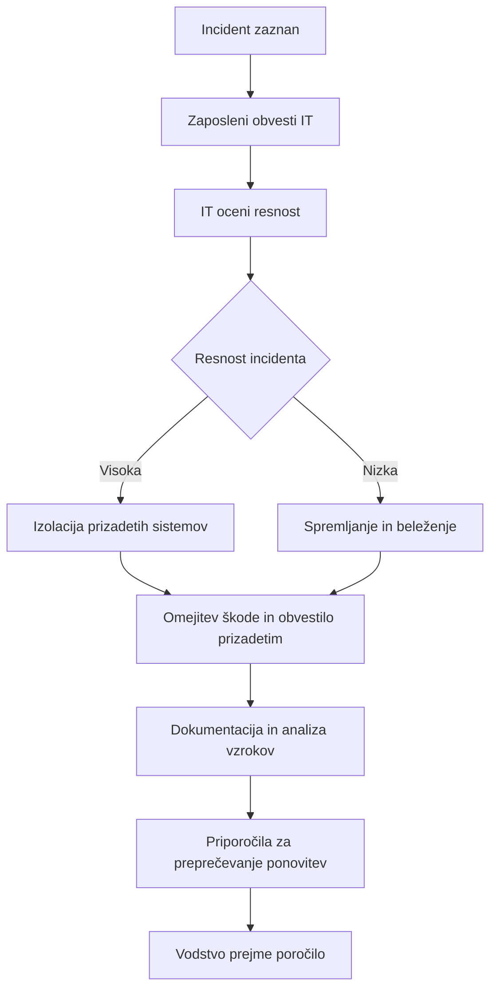

# Varnostna politika podjetja [EduAcademy]

## Namen in cilji politike
Varnostna politika opisuje načela, pravila in postopke, s katerimi podjetje varuje informacije, sisteme in podatke pred grožnjami. Cilji politike so:

- Zagotoviti zaupnost, celovitost in razpoložljivost informacij.
- Opredeliti odgovornosti zaposlenih in vodstva glede varnosti informacij.
- Vzpostaviti jasne postopke za preprečevanje, odkrivanje in reševanje varnostnih incidentov.
- Spodbuditi varnostno zavest pri vseh zaposlenih.
- Podpirati skladnost s pravnimi in regulativnimi zahtevami.
- Zmanjšati tveganje za finančno in reputacijsko škodo podjetja.
- Omogočiti hitro in učinkovito odzivanje na incidentne situacije.

## Področje uporabe
Politika velja za vse zaposlene, pogodbenike in sodelavce podjetja, ki uporabljajo informacijske sisteme, omrežja, e-pošto, prenosne naprave in druge IT vire podjetja. Vključuje tudi uporabo zunanjih storitev in programske opreme v oblaku.

## Odgovornosti
**Vodstvo:**
- Zagotavlja sredstva in podporo za izvajanje varnostne politike.
- Spremlja in ocenjuje učinkovitost varnostnih ukrepov.
- Odloča o ukrepih pri večjih incidentih.
- Skrbi za kulturo varnosti v podjetju in redno obvešča zaposlene.

**Zaposleni:**
- Upoštevajo varnostna pravila in postopke.
- Takojšnje poročajo sumljive aktivnosti ali incidente.
- Varujejo svoja gesla in dostop do sistemov.
- Redno posodabljajo računalniške naprave in programsko opremo.
- Sodelujejo pri izobraževanjih in testiranjih varnostne zavesti.

**IT oddelek:**
- Upravljajo in vzdržujejo varnostne sisteme.
- Preverjajo skladnost s politiko.
- Poročajo o incidentih in svetujejo zaposlenim.
- Spremljajo nove grožnje in predlagajo izboljšave.
- Izvajajo redne kontrole omrežja in sistemov.

## Postopki ob incidentih
Če pride do varnostnega incidenta (npr. izguba podatkov, nepooblaščen dostop, virus):

## Pravila za uporabo sistemov in gesel
- Gesla morajo biti močna (vsaj 12 znakov, kombinacija črk, številk in simbolov) in se redno spreminjati.
- Gesel ni dovoljeno deliti ali zapisovati na neprimernih mestih.
- Prenosne naprave in telefoni morajo biti zaščiteni z geslom ali PIN-kodo.
- Uporaba osebnih naprav za dostop do podjetniških podatkov je dovoljena le ob odobritvi IT oddelka.
- Ne nameščajte nepreverjene programske opreme.
- E-poštna sporočila z neznanih virov se ne odpirajo brez preverjanja.
- Družbena omrežja in osebne naprave se uporabljajo odgovorno in skladno s pravili podjetja.

## Spremljanje skladnosti
- IT oddelek redno preverja uporabo sistemov, gesel in omrežij.
- Redno se izvajajo interne kontrole in varnostni pregledi.
- Kršitve politike se evidentirajo in obravnavajo skladno s podjetniškimi pravili.
- Zaposleni sodelujejo v anketah in testiranjih varnostnega zavedanja.
- Posodabljanje varnostnih standardov in dokumentacije poteka periodično.

## Izobraževanje in osveščanje zaposlenih
- Politika se predstavi novim zaposlenim ob vstopu v podjetje.
- Organiziramo redna izobraževanja, delavnice in simulacije incidentov.
- Politika je vedno dostopna na intranetu podjetja.
- Uporabljajo se vizualni prikazi, preprosti primeri in kratki vodiči.
- Zaposleni se spodbuja k aktivnemu sodelovanju in predlogom izboljšav.

### Analiza obstoječe politike – prednosti in slabosti
**Prednosti:**
- Jasno opredeljeni cilji, odgovornosti in postopki.
- Pokriva ključne grožnje (izguba podatkov, nepooblaščen dostop, virusi).
- Tehnično natančna in primerna za IT strokovnjake.

**Slabosti:**
- Jezik je pogosto tehničen in težko razumljiv za ne-tehnične zaposlene.
- Nekateri vsakodnevni vidiki varnosti (npr. uporaba USB ključev, prenosnih naprav) so površno obravnavani.
- Potreben bi bil vizualni prikaz postopkov za boljšo preglednost.

### Ključni deli naše varnostne politike
- Namen in cilji – zaupnost, celovitost, razpoložljivost informacij.
- Področje uporabe – vsi zaposleni, pogodbeniki in IT viri podjetja.
- Odgovornosti – razdeljene med vodstvo, zaposlene in IT oddelek.
- Postopki ob incidentih – takojšnje obveščanje, ocena resnosti, izolacija, dokumentacija in analiza.
- Pravila za uporabo sistemov in gesel – močna gesla, zaščita naprav, odgovorna uporaba.
- Spremljanje skladnosti – interne kontrole, ankete, pregled sistemov.
- Izobraževanje in osveščanje zaposlenih – delavnice, intranet, vizualni prikazi.

### Komunikacija zaposlenim
- Politiko predstavimo novim zaposlenim ob vstopu v podjetje.
- Redna izobraževanja in delavnice.
- Politika dostopna na intranetu podjetja.
- Vizualni diagrami in praktični primeri za lažje razumevanje.
- Spodbujanje aktivnega sodelovanja zaposlenih pri varnostnih praksah.

### Spremljanje izvajanja politike
- Redni pregledi IT oddelka.
- Evidentiranje in analiza incidentov.
- Ankete in testiranja zavedanja zaposlenih.
- Posodabljanje politike glede na nove grožnje in tehnološke spremembe.
- Poročanje vodstvu o skladnosti in učinkovitosti ukrepov.

